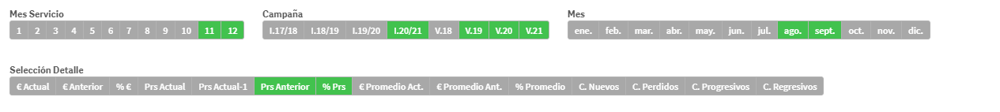

# Sistel Qlik Sense horizontal selections

Create and interact with field selections with this easy-to-use extension.

## Download

Download the latest version from [here](https://github.com/JordiFerrerB/sis-horizontalselector/raw/main/build/sis-horizontalselector.zip).

## Creating a selection menu

* Dimensions
    * Field name
    * Label
    * Sort Order
        * Automatic
        * Custom
            * By load order
            * By numeric order
            * By alphabetical order

